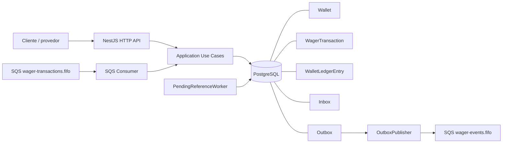

# Arquitetura da implementação

## Visão geral

O serviço processa operações de wagering por HTTP e SQS usando os mesmos casos de uso. PostgreSQL é a fonte de verdade para saldo, idempotência, concorrência e recuperação. SQS FIFO melhora a ordenação, mas não substitui as garantias do banco.



Cada instância Nest inicia automaticamente o consumer, o publisher da Outbox e o worker de referências pendentes. Todos coordenam trabalho por estado persistido e locks PostgreSQL.

## Modelo financeiro

### Money

Valores monetários não usam `number`. `Money` encapsula `decimal.js`, valida a moeda e a entrada decimal e normaliza a escala para duas casas. Operações retornam novas instâncias e exigem moedas iguais.

Nos contratos e eventos, o valor é serializado como string:

```json
{ "amount": "10.00", "currency": "BRL" }
```

Isso evita arredondamentos binários como os produzidos por ponto flutuante JavaScript. O banco usa `NUMERIC(19,2)`.

### Wallet, WagerTransaction e Ledger

- **Wallet** é o estado materializado atual: player, moeda, saldo e versão.
- **WagerTransaction** registra a operação solicitada, seu status, valor, identidade externa, idempotência e eventual referência.
- **WalletLedgerEntry** é o histórico financeiro imutável com valor, direção e saldos anterior/posterior.

O invariante central é:

```text
wallet.balance == saldo reconstruído pelo ledger
```

Cada alteração de saldo gera no máximo um lançamento por transação e wallet. A constraint única `(transaction_id, wallet_id)` impede duplicidade, checks validam a aritmética e um trigger PostgreSQL bloqueia `UPDATE` e `DELETE` do ledger. Divergências são reportadas; não há correção silenciosa.

### Efeito das operações

| Operação | Wallet | Ledger |
|---|---|---|
| `BET` | debita; rejeita se não houver saldo | `DEBIT` |
| `WIN` | credita | `CREDIT` |
| `LOSS` | não altera | nenhum lançamento |
| `REFUND` | devolve integralmente uma BET processada | `CREDIT` |
| `ROLLBACK` | aplica o inverso da referência | `CREDIT` ou `DEBIT` |

`LOSS` apenas registra o resultado: o valor da aposta já foi debitado por `BET`, por isso não há novo débito.

## Reversões e referências

`REFUND` e `ROLLBACK` recebem `referenceExternalTransactionId`. A referência é localizada por `(providerId, externalTransactionId)` e precisa estar `PROCESSED`, com mesmo provider, player, wallet, moeda, rodada e valor.

- `REFUND` aceita somente referência `BET` e devolve o valor integral uma vez.
- `ROLLBACK` aceita `BET`, `WIN` ou `REFUND`, aplica o efeito inverso uma vez e é rejeitado se o débito resultante tornaria o saldo negativo.

Os códigos estáveis usados nessas validações são `REFERENCE_NOT_PROCESSED`, `REFERENCE_CONTEXT_MISMATCH`, `REFERENCE_AMOUNT_MISMATCH`, `REFERENCE_TYPE_MISMATCH`, `REFERENCE_ALREADY_REVERSED` e `REVERSAL_WOULD_CAUSE_NEGATIVE_BALANCE`. Uma BET sem saldo usa `INSUFFICIENT_FUNDS`.

## Referências fora de ordem

Quando a referência ainda não existe, a reversão é persistida como `PENDING_REFERENCE`, sem alterar saldo ou ledger. O PostgreSQL armazena `referenceAttempts` e `nextReferenceAttemptAt`.

O `PendingReferenceWorker` consulta somente itens vencidos, usando `FOR UPDATE SKIP LOCKED`, e agenda backoff exponencial persistente:

```text
tentativa 1: 1 s
tentativa 2: 2 s
tentativa 3: 4 s
tentativa 4: 8 s
tentativa 5: 16 s
```

O loop verifica trabalho a cada 250 ms e processa lotes de até 10. Se a referência aparecer, a operação segue as mesmas validações e pode virar `PROCESSED` ou `REJECTED`. Depois da quinta tentativa sem referência, fica `REJECTED` com `REFERENCE_NOT_FOUND` e o evento de rejeição é gravado na Outbox.

## Idempotência

A API exige `Idempotency-Key`; mensagens SQS carregam `idempotencyKey`. O caso de uso persiste a chave em PostgreSQL, bloqueia sua linha com `FOR UPDATE` e associa à WagerTransaction um SHA-256 do payload de negócio com chaves ordenadas.

O hash inclui wallet, player, provider, id externo, rodada, jogo, kind, valor/moeda e eventual referência. Metadados de transporte e o header não entram no hash.

- mesma chave e mesmo payload: retorna a transação e o saldo originalmente observados, com `idempotentReplay: true`;
- mesma chave e payload diferente: conflito HTTP `409`;
- chave nova: executa e persiste o resultado uma vez.

Não existe cache de idempotência em memória. A garantia continua após restart e entre instâncias.

## Concorrência

A unidade de concorrência é `walletId`. Depois de serializar a chave idempotente, o caso de uso carrega a Wallet com lock pessimista PostgreSQL (`SELECT ... FOR UPDATE`). Isso impede lost update e saldo negativo sem bloquear globalmente todas as wallets.

No cenário com saldo `100.00` e duas BET simultâneas de `80.00`, uma transação debita e fica `PROCESSED`; a outra observa o novo saldo, fica `REJECTED` com `INSUFFICIENT_FUNDS`; o saldo final é `20.00` e existe um único `DEBIT`. Wallets distintas usam linhas distintas e continuam em paralelo.

Locks não vivem na memória do Nest. Múltiplas instâncias compartilham PostgreSQL e SQS, e o banco coordena Wallet, idempotência, Inbox, Outbox e referências pendentes. O Compose suporta:

```bash
docker compose up --build --scale app=3 -d
```

Não há sticky session, Redis ou lock distribuído externo.

## Transações e eventos

PostgreSQL e SQS não oferecem uma transação distribuída única. Publicar diretamente durante a operação financeira criaria dual-write: o banco poderia confirmar e o envio falhar, ou o evento poderia sair antes de um rollback.

A implementação grava, na mesma transação PostgreSQL aplicável:

- Wallet e WagerTransaction;
- WalletLedgerEntry, quando há mudança financeira;
- Inbox, quando a origem é SQS;
- mensagens da Outbox.

Os eventos implementados são `WagerTransactionProcessed`, `WagerTransactionRejected`, `WalletBalanceChanged` e `WagerTransactionPendingReference`. `WalletBalanceChanged` existe somente quando o saldo muda; `LOSS` gera apenas o evento de transação processada.

### Transactional Outbox

Mensagens nascem `PENDING`. O `OutboxPublisher` seleciona apenas itens vencidos com `FOR UPDATE SKIP LOCKED`, permitindo publishers concorrentes sem selecionar a mesma linha simultaneamente. Após sucesso, atualiza para `PUBLISHED`, define `publishedAt` e incrementa `attempts`.

Publicação usa:

- fila `wager-events.fifo`;
- `MessageGroupId = walletId`;
- `MessageDeduplicationId = outboxMessage.id`.

Falhas mantêm `PENDING` e persistem `attempts` e `nextAttemptAt`. O backoff é `1 s × 2^(attempts anteriores)`: 1 s, 2 s, 4 s, 8 s etc. O estado sobrevive a restart.

Se o SQS aceitar e o processo morrer antes de `PUBLISHED`, a transação PostgreSQL é revertida e outra instância tenta novamente. O deduplication id estável reduz duplicatas na janela FIFO, mas a arquitetura não afirma exactly-once.

### Inbox, ACK e redelivery

SQS entrega at-least-once. O consumer registra a Inbox com unicidade `(consumerName, messageId)`, bloqueia o registro e executa Inbox + operação financeira na mesma transação. `DeleteMessage` ocorre somente depois do commit.

Se o processo morrer depois do commit e antes do ACK, o SQS entrega novamente. A nova instância encontra a Inbox `PROCESSED`, não repete o efeito financeiro e então envia o ACK.

Classificação atual:

- **negócio:** o caso de uso persiste `REJECTED`; depois do commit há ACK;
- **infraestrutura transitória:** a transação sofre rollback, não há ACK e o redelivery/redrive nativo continua;
- **mensagem permanentemente inválida:** vai diretamente à DLQ e não cria `FAILED`;
- **infraestrutura permanente para mensagem válida:** SQLSTATE classe `42` ou `0A000` gera WagerTransaction `FAILED` com `PERMANENT_INFRASTRUCTURE_ERROR`, Inbox processada, nenhum ledger, envio à DLQ e remoção da origem somente após persistência.

`REJECTED` é decisão de negócio. `FAILED` é terminal e reservado à falha permanente apropriada de infraestrutura/processamento. Os estados terminais são `PROCESSED`, `REJECTED` e `FAILED`; `processedAt` é preenchido somente em `PROCESSED`.

Erros transitórios usam o redrive da fila principal (`maxReceiveCount = 3`) para `wager-transactions-dlq.fifo`. Não existe retry manual em memória por mensagem.

## SQS FIFO

As filas locais são:

- `wager-transactions.fifo`: entrada do consumer;
- `wager-transactions-dlq.fifo`: dead-letter queue da entrada;
- `wager-events.fifo`: eventos publicados pela Outbox.

Mensagens relacionadas usam `MessageGroupId = walletId`, preservando ordem por wallet no broker. A deduplicação FIFO é uma proteção adicional; PostgreSQL continua responsável pela correção financeira.

## Reconciliação

`POST /wallets/:walletId/reconciliation` lê os lançamentos em ordem, valida `balanceBefore`/`balanceAfter`, reconstrói o saldo com `Money` e compara com o saldo materializado da Wallet.

A resposta contém saldos armazenado/calculado, diferença, indicador `consistent` e quantidade de lançamentos. Divergência gera log e métrica, mas não altera Wallet nem Ledger.

## API e status HTTP

Os endpoints estão resumidos no README. Para submissão de wagering, o mapeamento implementado é:

| Situação | HTTP |
|---|---:|
| operação `PROCESSED` | `201` |
| `PENDING_REFERENCE` | `202` |
| regra de negócio `REJECTED` | `422` |
| request/header inválido | `400` |
| chave idempotente reutilizada com outro payload | `409` |
| recurso inexistente | `404` |
| falha inesperada | `500` |

Valores monetários permanecem strings. A resposta do POST expõe `transactionId`, não o nome interno `id`.

## Observabilidade

Os fluxos principais enviam objetos ao `Logger` do Nest com os identificadores disponíveis entre `correlationId`, `messageId`, `transactionId`, `walletId` e `providerId`. Payload financeiro completo não é registrado. O logger padrão, porém, não foi configurado para emitir JSON estrito; portanto essa parte literal do requisito de observabilidade permanece pendente.

`GET /metrics` expõe um snapshot com transações por status, duplicatas, retries, DLQ, conflitos de lock, lag da Outbox, contagem/latência de processamento e divergências de reconciliação. Essas métricas são locais e em memória por instância; não existe integração Prometheus/Grafana nem agregação externa.

Health checks são separados:

- `GET /health/live`: não consulta dependências;
- `GET /health/ready`: verifica PostgreSQL com `SELECT 1` e acesso à fila principal no SQS.

## Testes

A suíte contém testes unitários e integrações reais com PostgreSQL e LocalStack para:

- aritmética/validação de Money e invariantes da Wallet/Ledger;
- BET, WIN, LOSS, REFUND e ROLLBACK;
- referência inválida, reversão duplicada e reversão fora de ordem;
- idempotência, conflito de payload e 50 requests idênticas concorrentes;
- duas BET disputando a mesma Wallet e Wallets diferentes em paralelo;
- três processos independentes, restart e persistência de idempotência;
- morte do consumer após commit e antes do ACK;
- Inbox, redelivery, retry e DLQ;
- Outbox atômica, dois publishers, backoff e morte após aceitação pelo SQS;
- PENDING_REFERENCE, backoff, esgotamento e workers concorrentes;
- HTTP E2E pelos controllers Nest;
- health checks, migrations/constraints e reconciliação sem correção silenciosa.

Os testes distribuídos iniciam processos Bun independentes com pools MikroORM próprios, compartilhando somente PostgreSQL e SQS.

## Semântica de falhas distribuídas

O sistema não depende de exactly-once delivery. A garantia é composta por:

```text
at-least-once delivery
+ transações PostgreSQL
+ idempotência persistente
+ Inbox
+ unicidade do Ledger
```

Duplicatas podem existir no transporte e na publicação, mas não devem produzir débitos ou créditos duplicados.

## Autenticação

Autenticação foi intencionalmente deixada fora da implementação para priorizar correção financeira, concorrência, idempotência e mensageria distribuída, conforme permitido pelo desafio. Os endpoints atuais, inclusive health, não possuem guard.

Uma evolução natural é adicionar um `AuthGuard` NestJS nos controllers públicos, validando identidade emitida por um IdP externo. Health permaneceria público e mensagens SQS continuariam como canal interno, com validação dos identificadores de provedor pelo domínio.

## Trade-offs / Design Decisions

- **PostgreSQL como fonte de verdade:** concentra invariantes, coordenação e recovery, ao custo de contenção em wallets muito quentes.
- **Lock pessimista por Wallet:** torna o resultado financeiro simples e determinístico; operações da mesma wallet são serializadas.
- **Ledger imutável:** favorece auditoria e reconciliação; correções exigem novos lançamentos, nunca edição histórica.
- **Inbox/Outbox:** removem dependência de dual-write exatamente uma vez, aceitando redelivery controlada.
- **At-least-once:** reflete a semântica real do SQS; idempotência persistente absorve duplicatas.
- **Backoff persistente:** retries sobrevivem a restart, com mais estado e consultas no PostgreSQL.
- **SQS FIFO:** melhora ordem por wallet e deduplicação, sem assumir que o broker protege o saldo.
- **Money decimal-safe:** elimina imprecisão binária, exigindo serialização monetária explícita como string.

## Limitações conhecidas

- O build TypeScript atual falha em `query-wallets.use-case.ts` por um parâmetro `entry` implicitamente `any`; a imagem Docker não conclui enquanto isso não for corrigido.
- O fixture de `query-endpoints.use-case.spec.ts` cria uma BET incompatível com a constraint obrigatória de rodada/jogo, causando a única falha da suíte completa observada.
- O cálculo de lag no loop automático da Outbox assume `created_at` como `Date`; no runtime com métricas injetadas o driver pode retorná-lo como string.
- Métricas são locais e voláteis por instância.
- O Nest Logger recebe objetos estruturados, mas sua saída padrão não está configurada como JSON estrito.
- Não há autenticação, load balancer, tracing distribuído ou dashboard.
